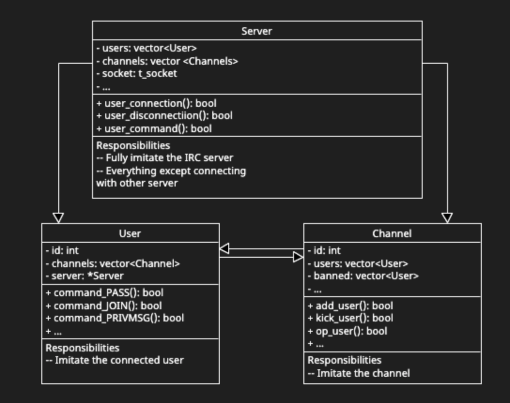

# "Ft_irc" project | Internet Relay Chat Server

IRC server following Internet RFC standards using C++. The project involved implementation of IRC protocol specications, resulting in a reliable server capable of facilitating real-time, text-based communication across networks.

> Predecessor of Discord in short :)




## Handled commands

This following list of commands are handled on our server, since most of them were not asked by the subject there is certain masks and parameters we may have ommited for our convinience, some commands might not be perfect aswell so if you find any issues feel free to let us know  :


```
- INVITE
- JOIN
- KICK
- NAMES
- PART
- TOPIC
- MODE
- NICK
- OPER
- QUIT
- USER
- KILL
- PING
- PONG
- NOTICE
- PRIVMSG
```

## Handled modes :

The following list of modes are handled by the server, yet again there may be omitted functionnality or errors :

```
USER MODES :
    - o : operator

CHANNEL MODES :
for users :
    - o : channel operator
for channels :
    - i : invite only
    - t : topic locked
    - k : key locked
    - l : user limit
```

# DOCS

*we recommend following the 281x versions instead as they not experimental*
- [RFC1459](https://datatracker.ietf.org/doc/html/rfc1459)
- [RFC2810](https://datatracker.ietf.org/doc/html/rfc2810)
- [RFC2811](https://datatracker.ietf.org/doc/html/rfc2811)
- [RFC2812](https://datatracker.ietf.org/doc/html/rfc2812)
- [RFC2813](https://datatracker.ietf.org/doc/html/rfc2813)

---
The project is made with Rizz by me and [Tom Gernez](https://github.com/Plaetorius)
